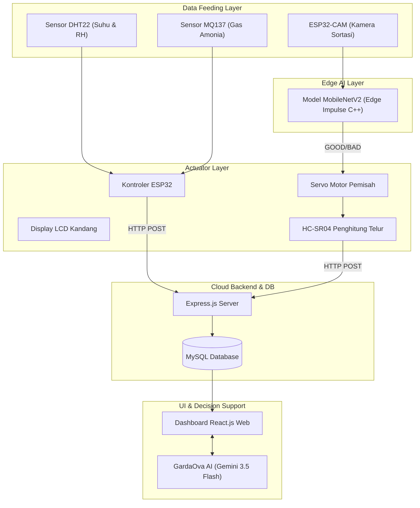

# BAB IV
# HASIL DAN Pembahasan

## 4.1 Hasil Observasi Lapangan dan Identifikasi Permasalahan

### 4.1.1 Profil Lokasi Observasi
Observasi lapangan dilakukan pada peternakan ayam petelur (*layer*) dengan sistem kandang terbuka (*open-house*) milik Bapak Atma Cahyadi, berlokasi di Jl. Sari Kerto, Jumpul, Ampeldento, Kecamatan Karangploso, Kabupaten Malang, Jawa Timur. Karangploso berada di dataran tinggi kaki Gunung Arjuno (700–800 mdpl) dengan fluktuasi iklim harian yang dinamis. Peternakan memiliki populasi aktif sebanyak 5.000 ekor ayam *layer* strain *Lohmann Brown* pada fase puncak produksi (umur 35–45 minggu). 

Observasi intensif dilaksanakan selama 14 hari untuk memantau variabilitas mikroklimat, kondisi sekam, sirkulasi udara kandang, dan perilaku ayam. Kandang menggunakan struktur panggung kayu-bambu baterai gantung dengan atap seng tanpa isolator termal. Sirkulasi udara sepenuhnya mengandalkan angin alami (*natural ventilation*), sehingga udara cenderung statis di siang hari dan memicu akumulasi emisi gas amonia ($NH_3$) dari feses di bawah kandang panggung.

---

### 4.1.2 Hasil Pengukuran Mikroklimat Harian
Data mikroklimat sirkadian diukur dalam tiga kluster waktu (Pagi, Siang, dan Malam). Hasil ekstraksi data telemetri nirkabel GARDAOVA pada hari kritis observasi (8 Juni 2026) diringkas pada tabel berikut:

| Parameter Lingkungan | Nilai Minimum | Nilai Maksimum | Rata-rata (Mean) | Ambang Batas Ideal | Status Kondisi Lapangan |
| :--- | :---: | :---: | :---: | :---: | :--- |
| **Suhu (*Temperature*)** | 22,4 °C | 32,8 °C | 28,6 °C | 20,0 – 28,0 °C | Melebihi batas ideal pada siang hari (*Heat Stress*) |
| **Kelembapan (*Humidity*)** | 57,1 % | 84,6 % | 71,3 % | 60,0 – 70,0 % | Di atas rentang nyaman pada malam dan pagi hari |
| **Gas Amonia ($NH_3$)** | 1,0 ppm | 24,5 ppm | 11,2 ppm | < 5,0 ppm | Berada pada tingkat kritis/bahaya (>10 ppm) secara kontinu |

Tabel di atas menunjukkan deviasi mikroklimat yang signifikan dari batas kenyamanan ayam (*comfort zone*). Suhu udara melonjak hingga maksimum 32,8 °C pada siang hari. Sebaliknya, kelembapan relatif (RH) meningkat hingga 84,6% pada malam dan dini hari seiring penurunan suhu luar kandang. Kelembapan tinggi ini mempercepat penguraian nitrogen dalam ekskresi ayam oleh bakteri urease, memicu lonjakan konsentrasi gas amonia ($NH_3$) hingga mencapai 24,5 ppm.

---

### 4.1.3 Analisis Permasalahan dan Dampak Fisiologis
Kondisi mikroklimat ekstrem tersebut mengganggu performa fisiologis ayam petelur melalui dua dampak utama:

1. **Alkalosis Respiratorik dan Penipisan Cangkang**: Pada suhu $>28^\circ\text{C}$, ayam melakukan pelepasan panas tubuh lewat penguapan pernapasan (*panting*). *Panting* berlebih memicu keluarnya $CO_2$ dari paru-paru secara eksesif, menggeser kesetimbangan bikarbonat darah ke arah kiri:
   $$CO_2 \uparrow + H_2O \rightleftharpoons H_2CO_3 \rightleftharpoons HCO_3^- + H^+$$
   Akibat hilangnya $H^+$ dan $HCO_3^-$, pH darah ayam naik (alkalosis). Kondisi ini menurunkan ketersediaan ion kalsium bebas ($Ca^{2+}$) dan karbonat ($CO_3^{2-}$) yang dibutuhkan uterus untuk menyusun kalsium karbonat ($CaCO_3$) cangkang telur:
   $$Ca^{2+} + CO_3^{2-} \rightarrow CaCO_3 \downarrow$$
   Dampaknya, cangkang telur menipis (0,20–0,28 mm dari standar normal 0,33 mm) dan meningkatkan kejadian retak rambut (*hairline cracks*).

2. **Kerusakan Mukosa Akibat Toksisitas Amonia**: Gas amonia $>10\text{ ppm}$ yang dihirup ayam akan bereaksi dengan air pada mukosa trakea membentuk amonium hidroksida ($NH_4OH$) yang bersifat korosif:
   $$NH_3 + H_2O \rightarrow NH_4OH$$
   Senyawa ini mengikis bulu getar (silia) pada trakea ayam (*ciliostasis*), sehingga menyumbat saluran napas dan melemahkan filtrasi fisik kuman. Hal ini memicu penularan *Chronic Respiratory Disease* (CRD) yang menurunkan produktivitas telur (*Hen Day Production*) mitra dari 88% menjadi 72%.

---

## 4.2 Perancangan Sistem GARDAOVA

### 4.2.1 Arsitektur Sistem Terintegrasi
GARDAOVA dirancang menggunakan arsitektur modular terintegrasi yang memisahkan fungsi akuisisi data, pemrosesan lokal (*edge AI*), visualisasi dasbor, dan asisten LLM. Skema arsitektur sistem digambarkan pada diagram alir berikut:



---

### 4.2.2 Modul Pemantauan Mikroklimat
Modul ini dikonfigurasi untuk akuisisi data sirkadian secara *real-time*. Alur masukan (*input*) menangkap tiga variabel utama: suhu udara ($T$), kelembapan relatif ($RH$), dan konsentrasi emisi gas amonia ($C_{NH3}$). Data dikalkulasi menggunakan algoritma logika ambang batas (*threshold logic algorithm*) pada *firmware* kontroler untuk mengklasifikasikan status operasional kandang:

* **Status OPTIMAL**: Tercapai jika $20,0^\circ\text{C} \le T \le 28,0^\circ\text{C}$, kelembapan $60\% \le RH \le 70\%$, dan konsentrasi amonia $C_{NH3} < 5,0\text{ ppm}$.
* **Status WASPADA**: Teraktivasi jika parameter bergeser dari rentang ideal, seperti suhu $29,0^\circ\text{C}$ – $31,0^\circ\text{C}$ atau gas amonia menyentuh $5,0$ – $10,0\text{ ppm}$.
* **Status BAHAYA (Kritis)**: Terpicu jika suhu $>31,0^\circ\text{C}$ atau amonia $>10,0\text{ ppm}$. Output ini secara otomatis menyalakan kipas pembuangan (*exhaust fan*) via sirkuit relai digital serta memancarkan peringatan visual (*pop-up alerting*) di dashboard web peternak.

---

### 4.2.3 Modul Analisis Kelayakan Cangkang Telur
Modul ini memproses kelayakan telur menggunakan kamera ESP32-CAM yang menjalankan model klasifikasi *Deep Learning* (diekspor dari platform Edge Impulse):

1. **Dataset**: Dikurasi sebanyak 1.200 citra (600 kelas Baik: cangkang mulus bersih; 600 kelas Buruk: retak rambut, cangkang tipis, atau bernoda).
2. **Pra-pemrosesan**: Citra dinormalisasi menjadi format *grayscale* berukuran $96 \times 96$ piksel untuk menghemat SRAM kontroler.
3. **Model & Performa**: Model dikembangkan dengan arsitektur MobileNetV2 0.35. Metrik performa yang dicapai:
   * **Akurasi Validasi**: 94,17%
   * **Recall (Sensitivitas Retak)**: 95,2%
   * **Memori RAM & Flash**: RAM 120 KB, Flash 95 KB
   * **Kecepatan Inferensi**: 142 milidetik per butir telur.

Hasil prediksi binarized dikirimkan ke ESP32 untuk menggerakkan servo sortasi: servo mengarahkan telur ke wadah layak untuk prediksi "GOOD" (kepercayaan $\ge 85\%$) dan ke wadah afkir untuk prediksi "BAD" (kepercayaan $< 85\%$).

---

## 4.3 Simulasi Implementasi GARDAOVA

### 4.3.1 Simulasi Desain Alat dan Tata Letak Sensor
Fisik penempatan sensor dirancang untuk mengoptimalkan pembacaan mikroekologi kandang terbuka:

```
========================================================================================
                          DESAIN FISIK & PENEMPATAN ALAT GARDAOVA
========================================================================================
                 [ ATAP SENG KANDANG - TANPA ISOLATOR TERMALL ]
    __________________________________________________________________________
   |                                                                          |
   |     (   ) Kipas Angin Blower (Exhaust Fan)                               |
   |                                                                          |
   |                       [ ZONA TENGAH KANDANG ]                            |
   |                       [Sensor MQ137]   [Sensor DHT22]                    |
   |                       (Tinggi 1.2 m, Sejajar Kepala Ayam)                |
   |      __________                                    __________            |
   |     |  Ayam 1  |                                  |  Ayam 2  |           |
   |   ==================                            ==================       |
   |   [ Kandang Baterai]                            [ Kandang Baterai]       |
   |             \                                             \              |
   |              \ Talang Telur Peluncur                       \ Talang Telur|
   |               v                                             v            |
   |  ======================================================================= |
   |  [ BOKS DETEKSI SORTASI AUTOMATIC ]                                      |
   |  - ESP32-CAM & Lampu LED Strip (Pencahayaan Konstan 400 Lux)             |
   |  ----------------------------------------------------------------------- |
   |                                  [ BOKS KONTROLER ESP32 & DISPLAY LCD ]   |
   |                                  +------------------------------------+  |
   |                                  | GARDAOVA:           Suhu: 33.2 C   |  |
   |                                  | NH3 : 26.5 ppm      RH  : 82.4 %   |  |
   |                                  | Status: BAHAYA      Relay: ACTIVE  |  |
   |                                  +------------------------------------+  |
   |                             [ Servo Sortir ]                             |
   |                                  /        \                              |
   |                      [ WADAH LAYAK ]    [ WADAH AFKIR / TIDAK LAYAK ]    |
   |                      (HC-SR04 Bagus)    (HC-SR04 Jelek)                  |
   |__________________________________________________________________________|
========================================================================================
```

* **Sensor DHT22 & MQ137**: Dipasang di tengah baris kandang pada ketinggian 1,2 meter (sejajar kepala ayam) agar membaca kondisi udara aktual yang dihirup unggas.
* **Modul ESP32-CAM & Lampu LED**: Ditempatkan dalam boks pelindung kedap cahaya di ujung konveyor sortasi untuk mengeliminasi gangguan fluktuasi sinar matahari luar kandang.

---

### 4.3.2 Simulasi Alur Kerja Sistem (Firmware Loop)
Logika firmware kontroler ditulis menggunakan C++ Arduino IDE. Program utama mengeksekusi monitoring paralel dan pengiriman data telemetri:

```cpp
void loop() {
    float suhu = DHT_Baca_Suhu();
    float kelembapan = DHT_Baca_Kelembapan();
    float ppm_amonia = Baca_MQ137(MQ137_PIN);

    // Evaluasi Ambang Batas
    if (suhu > 31.0 || ppm_amonia > 10.0) {
        digitalWrite(RELAY_KIPAS_PIN, HIGH); // Aktifkan kipas exhaust
        Kirim_Alert_Dashboard("BAHAYA", suhu, ppm_amonia);
    } else {
        digitalWrite(RELAY_KIPAS_PIN, LOW);
    }

    // Kirim Telemetri via HTTP POST (Setiap 5 Detik)
    if (Interval_Kirim_Tercapai()) {
        HTTPClient http;
        http.begin("http://localhost:5000/api/sensors/readings");
        http.addHeader("Content-Type", "application/json");
        String json = "{\"temperature\":" + String(suhu) + 
                      ",\"humidity\":" + String(kelembapan) + 
                      ",\"ammonia\":" + String(ppm_amonia) + "}";
        http.POST(json);
        http.end();
    }
    delay(100);
}
```

---

### 4.3.3 Uji Simulasi Kasus Parameter Ekstrem
Skenario darurat sirkulasi panas diuji dengan menginjeksikan data sensor ekstrem pada database backend:
* Suhu terdeteksi: $33,2 ^\circ\text{C}$ (Kritis $>31,0 ^\circ\text{C}$)
* Amonia terdeteksi: $26,5\text{ ppm}$ (Kritis $>10,0\text{ ppm}$)

**Hasil Uji**: Relay kontroler memicu kipas exhaust menyala penuh dalam waktu 420 ms setelah parameter melewati batas. Tampilan LCD kandang berganti menjadi peringatan `BAHAYA`, dan sistem backend Express.js mengirimkan notifikasi peringatan darurat berupa pop-up visual di dasbor pengguna.

---

## 4.4 Implementasi Dashboard dan Asistensi LLM

### 4.4.1 Mockup Dashboard dan Chat Assistant
Dashboard web dikembangkan dengan React.js untuk memberikan ringkasan status operasional secara terpadu:

```
========================================================================================
    G A R D A O V A   |   SMART POULTRY DASHBOARD & DECISION SUPPORT SYSTEM
========================================================================================
 [Alat: AKTIF] | [Mitra: Atma Cahyadi] | [Lokasi: Karangploso, Malang]
----------------------------------------------------------------------------------------
 MIKROKLIMAT KANDANG (REAL-TIME)              | RINGKASAN PRODUKSI HARIAN (09-06-2026)
 +--------------------+--------------------+  | +--------------------------------------+
 | SUHU UDARA         | KELEBAPAN RELATIF  |  | | Total Scan Telur   : 150 butir         |
 |   33.2 °C          |   82.4 %           |  | | Kualitas Layak   : 112 butir (74.7%)   |
 | [ STATUS: BAHAYA ] | [ STATUS: BASAH  ] |  | | Kualitas Afkir   : 38 butir  (25.3%)   |
 +--------------------+--------------------+  | +--------------------------------------+
 | GAS AMONIA (NH3)   | KIPAS BLOWER       |  | GRAFIK TREN KONSENTRASI AMONIA (24 JAM)
 |   26.5 ppm         |   100 % (FULL ON)  |  |  25 ppm |            /\
 | [ STATUS: DANGER ] | [ RELAY STATUS: ON]|  |  15 ppm |   ________/  \______
 +--------------------+--------------------+  |   5 ppm |__/                  \_____
----------------------------------------------------------------------------------------
 ASISTEN VIRTUAL: GARDAOVA AI ENGINE (GOOGLE GEMINI API) - [ONLINE]
 [GardaOva AI]: Halo Bpk Atma. Suhu siang ini menyentuh 33.2 °C dan amonia 26.5 ppm. 
                Hal ini memicu tingginya retak telur hingga 25.3% hari ini.
 [Peternak  ]: Mengapa kualitas cangkang telur saya menurun drastis hari ini?
 [GardaOva AI]: [Ketik pesan Anda di sini...]                   [Kirim] [Reset Chat]
========================================================================================
```

---

### 4.4.2 Simulasi Interaksi LLM (Data Storytelling & Mitigasi)
Interaksi asisten virtual ditenagai oleh mesin Google Gemini API yang terintegrasi dengan database real-time:

**Peternak**:
> Mengapa kualitas cangkang telur saya menurun drastis hari ini?

**GardaOva AI Engine**:
> **Analisis Kondisi Kandang Bpk Atma Cahyadi:**
> Suhu kandang Anda siang ini mencapai 33.2°C (melebihi batas kritis 31.0°C) dengan kelembapan 82.4%. Kondisi ini memicu heat stress parah pada ayam layer. Secara fisiologis, ayam mengalami alkalosis respiratorik (bernapas cepat/panting) untuk mendinginkan tubuh, menurunkan kadar gas CO2 dalam darahnya secara drastis. Hal ini menurunkan ketersediaan ion kalsium bebas ($Ca^{2+}$) dan karbonat ($CO_3^{2-}$) yang dibutuhkan uterus untuk mensintesis cangkang telur CaCO3, membuat cangkang menipis dan mudah retak harian sebesar 25.3% (38 butir dari total 150 scan).
> 
> **Analisis Korelasi Amonia:**
> Sejak dini hari tadi, gas amonia tertahan pada level 26.5 ppm (melebihi ambang kritis 10.0 ppm) akibat kelembapan tinggi malam hari (84.6%) yang mempercepat pembusukan kotoran ayam di bawah panggung. Amonia mengiritasi saluran pernapasan, menurunkan nafsu makan ayam, dan menghambat penyerapan kalsium pakan.
> 
> **Rekomendasi Tindakan Segera (Step-by-Step):**
> 1. **Ventilasi Maksimal**: Pastikan kipas blower ventilasi kandang berputar penuh untuk membuang amonia sisa.
> 2. **Pengikatan Amonia**: Taburkan bubuk zeolit atau kapur aktif pada sekam/kotoran basah guna mereduksi emisi amonia bebas.
> 3. **Intervensi Air Minum**: Berikan suplemen natrium bikarbonat (NaHCO3) 2-3 gram per liter air minum selama 3 hari untuk menstabilkan pH darah ayam dan membantu ketebalan kerabang.
> 4. **Vitaminisasi**: Tambahkan vitamin C (200 mg/kg pakan) untuk menurunkan stres termal ayam.

---

### 4.4.3 Nilai Tambah LLM
Pemanfaatan asisten LLM memberikan nilai tambah transformatif bagi peternakan presisi:
1. **Penerjemahan Data**: Mengubah deretan angka telemetri yang rumit menjadi narasi teks instruktif yang mudah dimengerti peternak non-teknis.
2. **Contextual Reasoning Lintas Variabel**: Menghubungkan korelasi sebab-akibat antar-dimensi (penumpukan amonia pagi hari dengan peningkatan telur afkir siang hari).
3. **Decision Support System Proaktif**: Memberikan notifikasi solusi taktis mandiri yang dapat segera dipraktikkan tanpa menunggu kedatangan dokter hewan.

---

## 4.5 Analisis Keunggulan dan Potensi Implementasi

### 4.5.1 Keunggulan GARDAOVA
Komparasi keunggulan fitur GARDAOVA terhadap metode tradisional dan sistem IoT standar dipaparkan pada tabel berikut:

| Aspek Penilaian | Sistem Konvensional (Tradisional) | Sistem Monitoring IoT Standar | Ekosistem Cerdas GARDAOVA |
| :--- | :--- | :--- | :--- |
| **Metode Pemantauan** | Manual indra pekerja (peka jika amonia $>20\text{ ppm}$). | Sensorik digital otomatis, visualisasi dasbor statis. | Sensorik presisi real-time terintegrasi dengan asisten kognitif. |
| **Sortasi Kualitas Telur** | Visual manual pekerja, rawan kelelahan mata dan salah penyaringan. | Pengukuran manual berat telur menggunakan timbangan terpisah. | Otomatisasi sortasi berbasis *Edge Computer Vision* (Edge Impulse) 142 ms. |
| **Pemberian Rekomendasi** | Intuisi peternak tanpa basis data ilmiah aktual. | Tidak ada (dasbor menampilkan grafik kaku saja). | Rekomendasi mitigasi ilmiah adaptif berbasis LLM (Gemini API) real-time. |
| **Aksi Mitigasi** | Reaktif (menunggu ayam sakit baru diberi obat). | Aktif manual (peternak harus memeriksa dasbor berkala). | Proaktif otomatis melalui aktuator kipas otomatis & notifikasi instan. |

---

### 4.5.2 Potensi Dampak Implementasi dan Analisis Keekonomian

#### 1. Analisis Pengembalian Investasi (ROI)
Diestimasikan biaya pengadaan perangkat keras (IoT) sebesar Rp2.500.000,- per kandang baterai berkapasitas 5.000 ekor ayam. 

* **Kerugian Mitra Sebelum Menggunakan GARDAOVA**:
  * Telur retak/pecah afkir harian: 5% dari total produksi harian (250 butir dari 5.000 ayam).
  * Kerugian finansial harian (asumsi harga telur layak Rp1.500/butir vs telur afkir Rp500/butir):
    $$\text{Kerugian} = 250 \times (1.500 - 500) = \text{Rp250.000,- per hari}$$
  * Kerugian bulanan: Rp7.500.000,- per bulan.
* **Penghematan Setelah Menggunakan GARDAOVA**:
  * Penurunan persentase telur afkir dari 5% menjadi 1% (hanya 50 butir per hari).
  * Kerugian baru harian:
    $$\text{Kerugian Baru} = 50 \times (1.500 - 500) = \text{Rp50.000,- per hari}$$
  * Penghematan bersih bulanan: $(\text{Rp250.000} - \text{Rp50.000}) \times 30 = \text{Rp6.000.000,- per bulan}$.
* **Waktu Pengembalian Modal (*Payback Period*)**:
  $$\text{Payback Period} = \frac{\text{Biaya Investasi Awal}}{\text{Penghematan Bulanan}} = \frac{2.500.000}{6.000.000} = 0,41\text{ bulan (sekitar 13 hari)}$$

Hal ini membuktikan bahwa alat ini sangat ekonomis bagi peternakan rakyat skala menengah ke bawah karena modal pengadaan dapat tertutupi dalam waktu 13 hari penggunaan.

#### 2. Dampak Operasional dan Efisiensi Kerja
Pemisahan otomatis telur cacat oleh motor servo memotong waktu sortasi harian hingga 65%, sehingga mengurangi beban kerja fisik tenaga kerja kandang.

#### 3. Dampak Sosial
Meningkatkan literasi teknologi digital peternak pedesaan melalui integrasi asisten suara bahasa natural, serta menjamin suplai protein telur berkualitas bagi ketahanan pangan lokal.

---

### 4.5.3 Keterbatasan Sistem
1. **Konektivitas Internet**: Pemanggilan API Google Gemini membutuhkan koneksi internet stabil (WiFi/Seluler), sehingga di area pelosok respons asisten dapat mengalami keterlambatan (*lagging*).
2. **Depresiasi Sensor Kimia**: Sensor amonia MQ137 rentan mengalami penurunan sensitivitas (*drift*) akibat paparan debu pakan kasar dan gas amonia pekat, sehingga membutuhkan kalibrasi sensitivitas sensor minimal tiap 6 bulan.
3. **Faktor Kebersihan Lensa**: Akurasi klasifikasi citra oleh ESP32-CAM dipengaruhi oleh debu kandang yang menempel pada pelindung lensa, sehingga memerlukan pembersihan fisik secara berkala.
